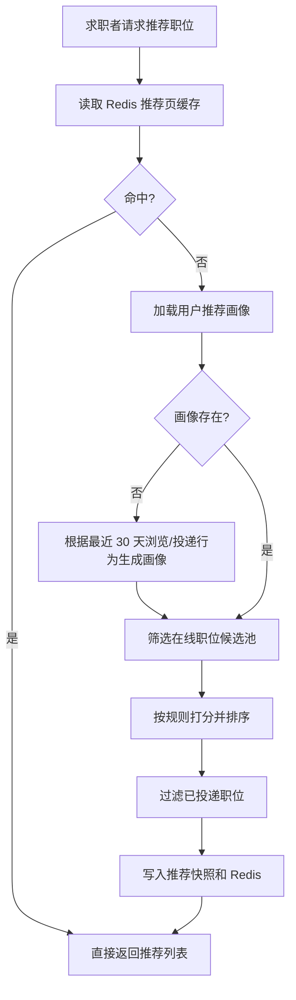

# 智能推荐职位设计

## 1. 功能目标

本功能面向求职者端，提供基于规则的“智能推荐职位”能力，不使用 AI 模型，只依赖用户行为和职位属性进行匹配。

核心输入：

- 最近浏览职位
- 最近投递职位
- 当前在线职位池
- 热门职位榜单

核心输出：

- 推荐职位列表
- 推荐原因文案
- 推荐分数

---

## 2. 推荐逻辑

### 2.1 行为权重

对最近 30 天行为赋权：

- 浏览职位详情：`1 分`
- 重复浏览同类职位：同一职位最多累计 `3 分`
- 投递职位：`5 分`

投递行为权重大于浏览行为，因为它更能代表真实意向。

### 2.2 用户兴趣画像

从行为关联到职位属性，统计出用户偏好：

- 偏好城市
- 偏好职位分类
- 偏好关键词
- 偏好薪资区间
- 偏好经验区间

画像生成规则：

1. 取最近 30 天浏览 + 投递行为
2. 将行为映射到职位属性
3. 按权重聚合，得到 top 城市、top 分类、关键词、薪资区间
4. 将画像落入 `candidate_recommend_profile`

### 2.3 候选职位池筛选

只从以下职位中挑选：

- `job_post.status = ONLINE`
- `job_post.audit_status = APPROVED`
- 未过期职位
- 用户未投递过的职位
- 最近 7 天没有明确跳过的职位

### 2.4 打分规则

建议总分 100 分：

- 职位分类匹配：40 分
- 城市匹配：20 分
- 薪资区间匹配：15 分
- 经验要求匹配：10 分
- 发布时间新鲜度：10 分
- 行为强化项：5 分

示例：

```text
recommendScore =
  categoryScore + cityScore + salaryScore + experienceScore + freshnessScore + behaviorBoost
```

### 2.5 冷启动策略

如果用户行为不足：

- 优先使用简历期望城市、期望职位、期望薪资
- 如果简历也不完整，则降级到热门职位榜 `recruit:job:hot:ranking`

---

## 3. 数据结构设计

### 3.1 行为事实表

- [recruit_recommendation_schema.sql](/D:/bishe/recruitment-platform/backend/sql/recruit_recommendation_schema.sql)
- 表：`candidate_job_behavior`

用途：

- 记录用户浏览/投递行为
- 支持离线画像计算
- 支持推荐效果分析

### 3.2 用户画像表

- 表：`candidate_recommend_profile`

用途：

- 保存聚合后的偏好画像
- 避免每次推荐都回扫全部行为明细

### 3.3 推荐快照表

- 表：`candidate_job_recommendation`

用途：

- 保存某天/某场景的推荐结果
- 支持推荐列表复用
- 支持点击率、投递率回溯

### 3.4 为什么这样拆表

- 行为明细表解决“原始数据沉淀”
- 画像表解决“快速生成偏好特征”
- 推荐快照表解决“接口稳定响应”和“效果复盘”

这比把所有逻辑都压在一次实时 SQL 查询里更适合真实项目。

---

## 4. 后端实现思路

### 4.1 当前已落地接口

- [JobApiController.java](/D:/bishe/recruitment-platform/backend/recruit-modules/recruit-job/src/main/java/com/company/recruit/job/controller/JobApiController.java)
- 新增接口：`GET /api/candidate/jobs/recommendations`

### 4.2 当前已落地代码骨架

- [CandidateRecommendJobQuery.java](/D:/bishe/recruitment-platform/backend/recruit-modules/recruit-job/src/main/java/com/company/recruit/job/query/CandidateRecommendJobQuery.java)
- [RecommendedJobItemVO.java](/D:/bishe/recruitment-platform/backend/recruit-modules/recruit-job/src/main/java/com/company/recruit/job/vo/RecommendedJobItemVO.java)
- [JobRecommendationService.java](/D:/bishe/recruitment-platform/backend/recruit-modules/recruit-job/src/main/java/com/company/recruit/job/service/JobRecommendationService.java)
- [JobFacadeService.java](/D:/bishe/recruitment-platform/backend/recruit-modules/recruit-job/src/main/java/com/company/recruit/job/service/JobFacadeService.java)

### 4.3 推荐流程



### 4.4 推荐服务拆分建议

建议拆成 4 个职责：

1. `JobBehaviorService`
   - 记录浏览/投递行为
2. `RecommendationProfileService`
   - 聚合生成用户画像
3. `JobRecommendationService`
   - 规则打分与列表生成
4. `RecommendationRefreshJob`
   - 定时刷新推荐快照

当前项目已经先落了 `JobRecommendationService` 骨架，方便后续往里填真实规则。

---

## 5. Redis 优化方案

### 5.1 已落地的 Redis Key

- [RedisKeyRegistry.java](/D:/bishe/recruitment-platform/backend/recruit-common/recruit-common-redis/src/main/java/com/company/recruit/common/redis/RedisKeyRegistry.java)

新增：

- `recruit:recommend:profile:{userId}`
- `recruit:recommend:page:{userId}:{scene}:{pageNo}:{pageSize}`
- `recruit:recommend:behavior:job:{userId}`
- `recruit:recommend:behavior:category:{userId}`
- `recruit:recommend:behavior:city:{userId}`

### 5.2 Redis 用法

#### 用户画像缓存

- Key：`recruit:recommend:profile:{userId}`
- TTL：30 分钟
- 内容：用户偏好城市、分类、薪资区间、关键词

#### 推荐结果页缓存

- Key：`recruit:recommend:page:{userId}:{scene}:{pageNo}:{pageSize}`
- TTL：10 分钟
- 内容：分页后的推荐职位列表

#### 行为实时聚合

- `job:{userId}`：记录职位浏览/投递热度
- `category:{userId}`：记录分类偏好权重
- `city:{userId}`：记录城市偏好权重

### 5.3 为什么 Redis 能提高推荐性能

- 推荐接口不必每次扫描行为明细表
- 高频浏览行为先落 Redis，后续异步刷库
- 推荐分页结果可以短时复用，减少重复计算
- 冷启动时可以快速降级到热榜

---

## 6. 当前落地范围

这次已经做进项目的内容：

- 推荐接口骨架
- 推荐查询对象和返回对象
- 推荐服务骨架
- 推荐表结构脚本
- Redis Key 规范
- 规则说明文档

还未接入的部分：

- MyBatis-Plus Mapper
- 真实行为写入数据库
- 定时推荐任务
- 推荐点击/转化统计

下一步最适合继续做的是：

1. 把浏览行为落到 `candidate_job_behavior`
2. 把投递行为同步写入推荐画像更新逻辑
3. 把 `/api/candidate/jobs/recommendations` 接成真实 SQL + Redis 推荐接口