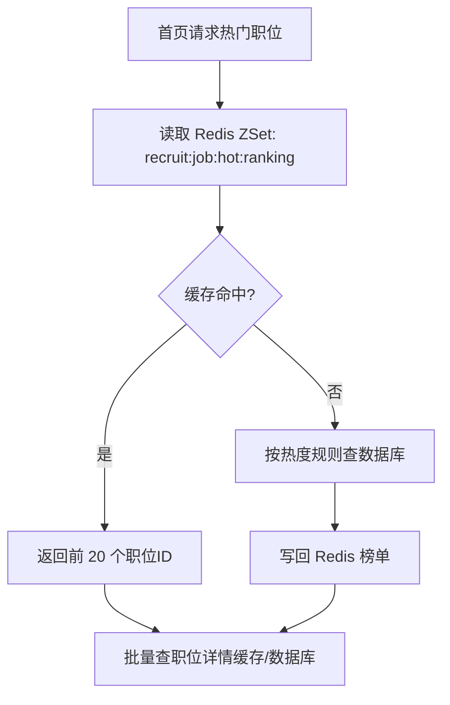
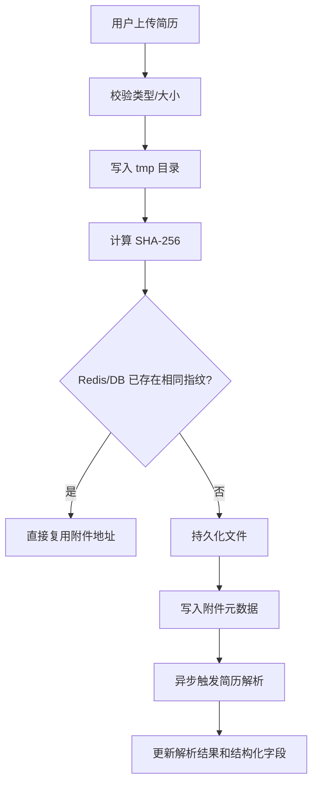

# 招聘系统性能优化方案

## 1. 优化目标

本方案面向招聘系统首期高频场景，重点优化以下链路：

- 公共职位列表与职位详情查询
- 热门职位榜单与首页推荐
- 求职者投递与招聘方处理投递
- 简历附件上传与解析
- 管理端分页查询

目标不是“全站都上缓存”，而是把高频读、多条件筛选、重复写和大文件上传这四类性能瓶颈拆开处理。

---

## 2. Redis 缓存设计

### 2.1 适合缓存的数据

| 数据类型 | Key 设计 | 建议 TTL | 落地原因 | 失效策略 |
| --- | --- | --- | --- | --- |
| 职位详情 | `recruit:job:detail:{jobId}` | 10 分钟 | 详情页访问频率高，职位信息更新频率低于访问频率 | 职位编辑、上下架、审核后主动删除 |
| 职位搜索结果页 | `recruit:job:search:{queryHash}` | 60 秒 | 搜索条件组合多，但热门筛选会重复命中 | 发布职位、职位状态变化时只清热点城市/分类缓存 |
| 热门职位榜 | `recruit:job:hot:ranking` | 常驻 + 定时重建 | 首页、推荐位高频访问 | 每 5 分钟重算一次，榜单兜底回源 |
| 公司详情 | `recruit:company:detail:{companyId}` | 30 分钟 | 公司详情变化少、展示频率高 | 企业信息审核通过或更新后删除 |
| 字典数据 | `recruit:dict:{typeCode}` | 12 小时 | 城市、学历、经验属于稳定数据 | 管理端改字典后按类型删除 |
| 未读消息数 | `recruit:message:unread:{userId}` | 30 分钟 | 页面头部频繁展示，不必每次 count(*) | 读消息、发消息时增量更新 |
| 简历附件去重指纹 | `recruit:resume:attachment:hash:{sha256}` | 7 天 | 避免同一附件重复上传和重复解析 | 新文件替换时自然过期即可 |
| 防重复提交锁 | `recruit:idempotency:{scene}:{actor}:{digest}` | 3-10 秒 | 避免重复投递、重复入驻、重复安排面试 | TTL 自然失效 |

### 2.2 缓存使用边界

- 不缓存强一致写数据，例如投递主表、面试结果本身。
- 不缓存超大结果集，只缓存前 3-5 页热点查询。
- 管理后台分页列表优先走数据库，不做长期缓存，避免审核数据脏读。

---

## 3. 热门职位优化

### 3.1 数据来源

热门职位不直接按 `view_count` 排序，而是综合以下权重：

- 近 7 天浏览量
- 近 7 天投递量
- 近 3 天收藏量
- 发布时间衰减系数

推荐公式：

```text
hotScore = viewCount * 0.2 + applyCount * 0.6 + favoriteCount * 0.2 - hoursFromPublish * 0.03
```

### 3.2 实现方案

1. 用户访问职位详情时，不同步更新数据库 `view_count`
2. 先写 Redis 计数器：
   - `recruit:job:view:counter`
   - `recruit:job:apply:counter`
3. 定时任务每 1 分钟批量刷回 MySQL
4. 每 5 分钟重建一次 `recruit:job:hot:ranking`
5. 首页只取前 N 个热门职位，避免实时排序全表扫描

### 3.3 推荐读取流程



### 3.4 为什么这样做

- 热门榜属于读多写多场景，实时写数据库会放大 IO
- 用 Redis 计数器承接高频更新，再异步刷盘，能把职位详情访问从“每次 1 次更新”降成“每分钟 1 次聚合更新”
- 热榜用 ZSet 比每次 `ORDER BY apply_count DESC, view_count DESC` 更稳

---

## 4. 数据库索引优化

### 4.1 已补充的索引脚本

已新增：

- [recruit_performance_indexes.sql](/D:/bishe/recruitment-platform/backend/sql/recruit_performance_indexes.sql)

### 4.2 核心索引设计

#### 职位表 `job_post`

- `(status, last_refresh_at, work_city_code)`
  - 用于职位列表“在线职位 + 城市 + 最新刷新”场景
- `(status, salary_min, salary_max)`
  - 用于薪资区间筛选
- `(status, apply_count, view_count, published_at)`
  - 用于后台统计和热度重建

#### 投递表 `job_application`

- `(candidate_user_id, process_stage, latest_status_at)`
  - 支撑“我的投递”按阶段过滤
- `(company_id, job_id, process_stage, latest_status_at)`
  - 支撑招聘方按职位看候选人
- `(recruiter_user_id, process_stage, latest_status_at)`
  - 支撑 HR 工作台待处理列表

#### 简历表 `resume_base`

- `(user_id, resume_status, updated_at)`
  - 支撑默认简历/活跃简历快速读取
- `(expectation_city, expectation_position)`
  - 支撑后续人才搜索扩展

#### 面试表 `interview_record`

- `(application_id, interview_status)`
  - 支撑投递详情查看面试列表
- `(coordinator_user_id, interview_status, scheduled_start_at)`
  - 支撑面试管理日程页

#### 通知表 `notify_user_message`

- `(receiver_user_id, delete_flag, read_status, created_at)`
  - 支撑消息中心未读与最近消息分页

### 4.3 索引原则

- 索引围绕“真实筛选条件 + 排序字段”组合
- 避免给低区分度单字段过度建索引
- 文本搜索字段如职位描述不加普通索引，后期接入 ES 再处理

---

## 5. 接口响应优化

### 5.1 职位列表接口

目标接口：`GET /api/jobs`

优化方式：

- 列表页只返回必要字段，不返回 `description_text`
- 公司名称、Logo、职位标签优先批量查询，避免 N+1
- 搜索条件做 300-500ms 前端防抖
- 同一查询条件 60 秒内优先走搜索页缓存

### 5.2 分页接口统一策略

- 默认页大小控制在 `20`
- 管理端允许 `50`，禁止无限大分页
- 只返回当前页字段，不返回大对象子表
- 统计字段如总投递数尽量异步汇总，避免主列表联表聚合

### 5.3 序列化与网络层

- 开启 HTTP gzip 压缩
- 统一超时设置：
  - 列表查询 3 秒
  - 上传接口 30 秒
- 图片和附件使用静态资源域名或对象存储地址，接口只返回 URL

### 5.4 读写分离思路预留

当前不做数据库主从，但代码层先把：

- 高并发读取尽量缓存化
- 写操作尽量最小事务
- 列表统计和明细读取解耦

后面如果扩容，可以平滑接读库。

---

## 6. 防止重复提交

### 6.1 已落地的后端拦截能力

已新增：

- [PreventDuplicateSubmit.java](/D:/bishe/recruitment-platform/backend/recruit-common/recruit-common-web/src/main/java/com/company/recruit/common/web/annotation/PreventDuplicateSubmit.java)
- [DuplicateSubmitInterceptor.java](/D:/bishe/recruitment-platform/backend/recruit-common/recruit-common-web/src/main/java/com/company/recruit/common/web/interceptor/DuplicateSubmitInterceptor.java)
- [IdempotencyProperties.java](/D:/bishe/recruitment-platform/backend/recruit-common/recruit-common-web/src/main/java/com/company/recruit/common/web/config/IdempotencyProperties.java)

### 6.2 当前接入的场景

- 用户注册
- 企业入驻提交
- 求职者投递职位
- 招聘方创建面试

### 6.3 实现方式

1. 前端对写请求自动附带 `X-Idempotency-Key`
2. 后端拦截带 `@PreventDuplicateSubmit` 的接口
3. Redis `SETNX + EXPIRE` 写入短锁
4. 在 3-10 秒窗口内重复请求直接返回 `DUPLICATE_SUBMIT`

### 6.4 为什么不用前端按钮禁用就算了

- 只做按钮禁用挡不住双击重放、弱网重试、并发请求和脚本重放
- 后端幂等控制才是最终兜底

---

## 7. 简历上传优化

### 7.1 当前建议

- 简历附件限制 `pdf/doc/docx`
- 单文件最大 10MB
- 上传时先落临时目录 `uploads/tmp`
- 计算文件 SHA-256，命中相同指纹则直接复用历史文件地址
- 上传成功后异步解析文本，不阻塞用户主流程

### 7.2 已补充配置

已扩展：

- [StorageProperties.java](/D:/bishe/recruitment-platform/backend/recruit-common/recruit-common-storage/src/main/java/com/company/recruit/common/storage/config/StorageProperties.java)
- [application.yml](/D:/bishe/recruitment-platform/backend/recruit-boot/src/main/resources/application.yml)

配置包括：

- `spring.servlet.multipart.max-file-size`
- `spring.servlet.multipart.max-request-size`
- `storage.local.resume-allowed-extensions`
- `storage.local.max-resume-size-mb`
- `storage.local.resume-hash-deduplicate`
- `storage.local.async-resume-parse`

### 7.3 推荐处理流程



### 7.4 二期建议

- 对接对象存储，前端直传 OSS/MinIO，后端只做签名与回调
- 上传完成后走消息队列异步解析
- 对可疑文件做病毒扫描

---

## 8. 本次落地文件

- Redis Key 扩展：
  - [RedisKeyRegistry.java](/D:/bishe/recruitment-platform/backend/recruit-common/recruit-common-redis/src/main/java/com/company/recruit/common/redis/RedisKeyRegistry.java)
- 重复提交防护：
  - [PreventDuplicateSubmit.java](/D:/bishe/recruitment-platform/backend/recruit-common/recruit-common-web/src/main/java/com/company/recruit/common/web/annotation/PreventDuplicateSubmit.java)
  - [DuplicateSubmitInterceptor.java](/D:/bishe/recruitment-platform/backend/recruit-common/recruit-common-web/src/main/java/com/company/recruit/common/web/interceptor/DuplicateSubmitInterceptor.java)
- 上传配置：
  - [StorageProperties.java](/D:/bishe/recruitment-platform/backend/recruit-common/recruit-common-storage/src/main/java/com/company/recruit/common/storage/config/StorageProperties.java)
- 索引脚本：
  - [recruit_performance_indexes.sql](/D:/bishe/recruitment-platform/backend/sql/recruit_performance_indexes.sql)

这套方案优先解决的是招聘系统最常见的三个真实问题：

- 首页和职位列表越来越慢
- 高峰时段重复投递/重复提交
- 简历上传和解析拖慢主流程

后续如果你继续做，我建议下一步把“职位详情缓存”和“热门职位榜单定时重建”先真正接进 `job` 模块，这两个收益最大。