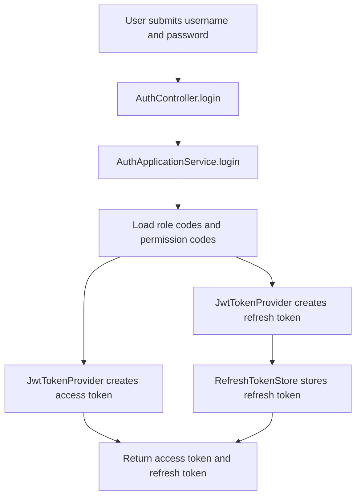
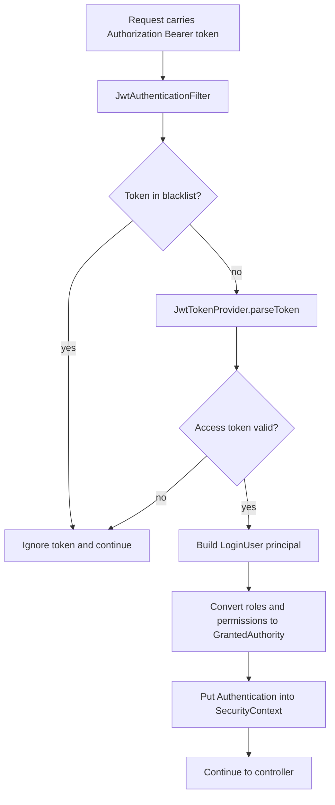
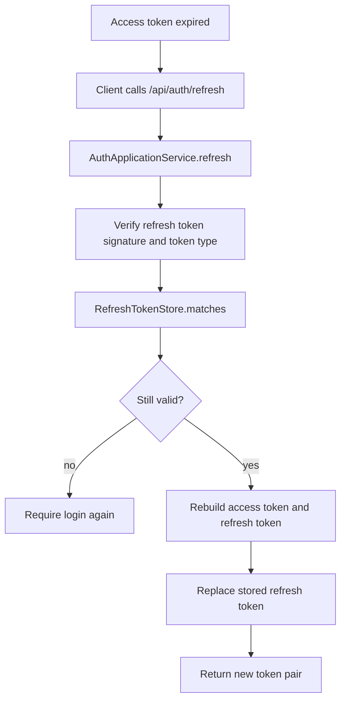

# Permission System Design

## 1. Roles

### CANDIDATE
- Complete profile and resume
- Search jobs and submit applications
- View application progress and notifications

### RECRUITER
- Maintain company profile
- Create and manage jobs
- View candidates, process applications, schedule interviews

### ADMIN
- Manage users and assign roles
- Audit companies and jobs
- Maintain platform governance permissions

## 2. RBAC Model

The project uses standard RBAC:

```text
user -> role -> permission
```

Core tables used by the permission system:
- `sys_user_account`: login account
- `sys_role`: role definition
- `sys_user_role`: user-role relation
- `sys_permission`: permission definition
- `sys_role_permission`: role-permission relation

## 3. Login Flow



## 4. JWT Validation Flow



## 5. Interface Authorization Flow

```mermaid
flowchart TD
    A[Request enters controller] --> B[SecurityConfig route rule]
    B --> C{Role path matched?}
    C -- no --> D[403 or 401]
    C -- yes --> E[@PreAuthorize method check]
    E --> F{Permission code matched?}
    F -- no --> D
    F -- yes --> G[Business service executes]
    G --> H[Optional data scope check by companyId or userId]
    H --> I[Return response]
```

## 6. Refresh Strategy



## 7. Expiration Strategy

- Access token: `7200s` (2 hours)
- Refresh token: `604800s` (7 days)
- Logout behavior:
  - add access token to blacklist store
  - remove refresh token from refresh store
- The current project uses in-memory stores as a runnable placeholder.
- In production, replace them with Redis keys:
  - `recruit:auth:blacklist:{token}`
  - `recruit:auth:refresh:{userId}`

## 8. Code Structure

### Security configuration
- `D:\bishe\recruitment-platform\backend\recruit-common\recruit-common-security\src\main\java\com\company\recruit\common\security\config\SecurityConfig.java`
- Responsibilities:
  - define public routes
  - define role path rules
  - enable method security
  - register JWT filter and exception handlers

### JWT provider
- `D:\bishe\recruitment-platform\backend\recruit-common\recruit-common-security\src\main\java\com\company\recruit\common\security\jwt\JwtTokenProvider.java`
- Responsibilities:
  - create access token
  - create refresh token
  - parse JWT claims
  - expose token TTL values

### JWT filter
- `D:\bishe\recruitment-platform\backend\recruit-common\recruit-common-security\src\main\java\com\company\recruit\common\security\jwt\JwtAuthenticationFilter.java`
- Responsibilities:
  - read `Authorization`
  - reject blacklisted tokens
  - parse access token
  - build `LoginUser`
  - push authentication into `SecurityContext`

### Security principal
- `D:\bishe\recruitment-platform\backend\recruit-common\recruit-common-security\src\main\java\com\company\recruit\common\security\context\LoginUser.java`
- Fields:
  - `userId`
  - `username`
  - `roleCodes`
  - `permissionCodes`
  - `companyIds`

### Helper to read current user
- `D:\bishe\recruitment-platform\backend\recruit-common\recruit-common-security\src\main\java\com\company\recruit\common\security\context\SecurityUtils.java`
- Responsibilities:
  - get current login user
  - get current user id

### Token stores
- `D:\bishe\recruitment-platform\backend\recruit-common\recruit-common-security\src\main\java\com\company\recruit\common\security\jwt\RefreshTokenStore.java`
- `D:\bishe\recruitment-platform\backend\recruit-common\recruit-common-security\src\main\java\com\company\recruit\common\security\jwt\TokenBlacklistStore.java`
- Responsibilities:
  - store refresh tokens
  - revoke refresh tokens on logout
  - block blacklisted access tokens

### Auth application service
- `D:\bishe\recruitment-platform\backend\recruit-modules\recruit-auth\src\main\java\com\company\recruit\auth\application\service\AuthApplicationService.java`
- Responsibilities:
  - login
  - register
  - refresh token
  - logout
  - assemble role and permission claims

## 9. Permission Control Implementation

The project uses 3 layers together:

1. Route role control
   - configured in `SecurityConfig`
   - examples:
     - `/api/candidate/** -> ROLE_CANDIDATE`
     - `/api/recruiter/** -> ROLE_RECRUITER`
     - `/api/admin/** -> ROLE_ADMIN`

2. Method permission control
   - implemented by `@PreAuthorize`
   - examples already added to controllers:
     - `job:create`
     - `job:update`
     - `company:audit`
     - `application:process`
     - `user:role:assign`

3. Data scope control
   - should be implemented in service layer
   - examples:
     - candidate only accesses own resume and applications
     - recruiter only accesses company scoped jobs and applications
     - admin can access all data

## 10. Recommended Next Step

To move from skeleton to production-ready behavior, the next step is:
- replace mock role/permission assembly with database loading from `sys_user_role` and `sys_role_permission`
- move `RefreshTokenStore` and `TokenBlacklistStore` to Redis implementation
- add data-scope validation in each business service
