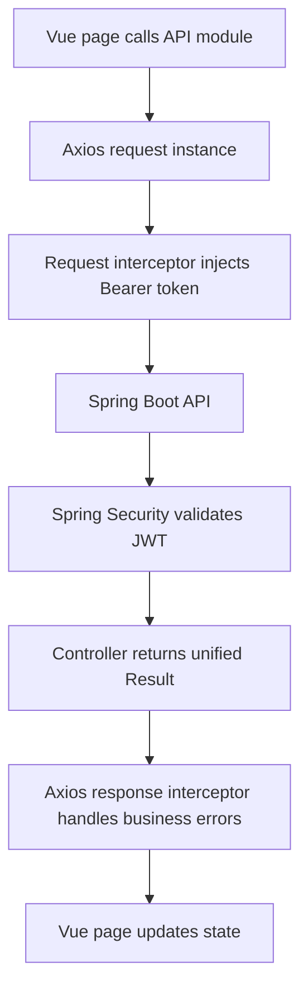
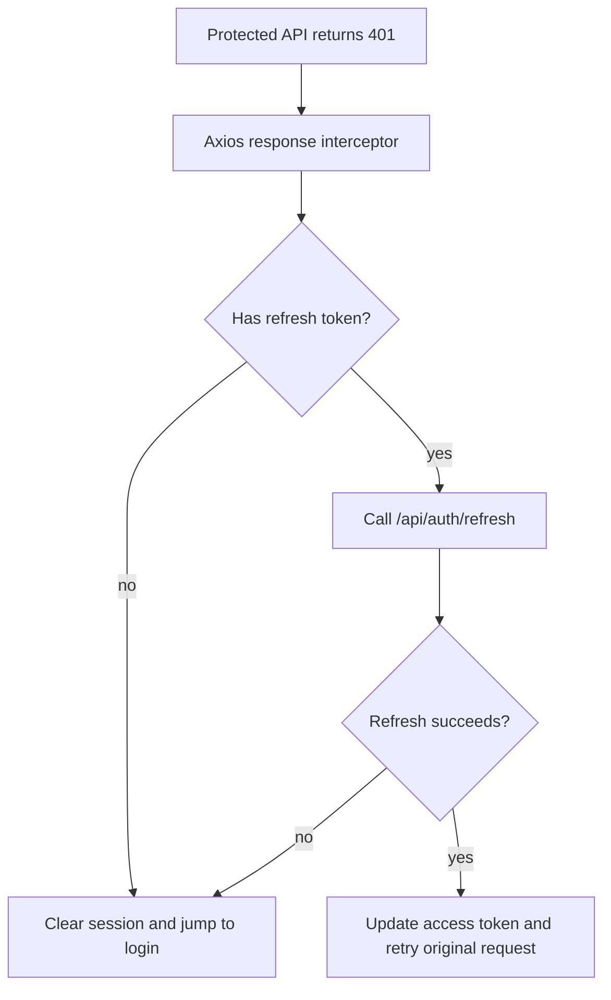

# Frontend-Backend Integration

## Frontend

### Axios encapsulation
- file: `src/api/request.ts`
- responsibilities:
  - inject token automatically
  - handle business errors uniformly
  - retry once after refresh when `401` happens
  - redirect to `/login` when refresh fails

### Login state management
- file: `src/stores/auth.ts`
- responsibilities:
  - persist `accessToken` and `refreshToken`
  - restore session from `localStorage`
  - clear session on logout or refresh failure
  - expose `hasPermission`

### API modules
- files:
  - `src/api/modules/auth.ts`
  - `src/api/modules/user.ts`
- responsibilities:
  - keep request definitions by domain
  - avoid page components calling axios directly

### Dev cross-origin handling
- file: `vite.config.ts`
- `/api` is proxied to `http://localhost:8080`
- local frontend can call backend without browser CORS interruption during dev

## Backend

### CORS configuration
- files:
  - `backend/recruit-boot/src/main/java/com/company/recruit/config/CorsConfig.java`
  - `backend/recruit-boot/src/main/java/com/company/recruit/config/CorsProperties.java`
  - `backend/recruit-boot/src/main/resources/application.yml`
- responsibilities:
  - allow `http://localhost:5173`
  - allow `http://127.0.0.1:5173`
  - support `Authorization` header
  - allow credentials and common HTTP methods

### Security integration
- file: `backend/recruit-common/recruit-common-security/src/main/java/com/company/recruit/common/security/config/SecurityConfig.java`
- `http.cors(Customizer.withDefaults())` is enabled
- JWT authentication still works together with CORS handling

## Request flow

## 401 refresh flow

